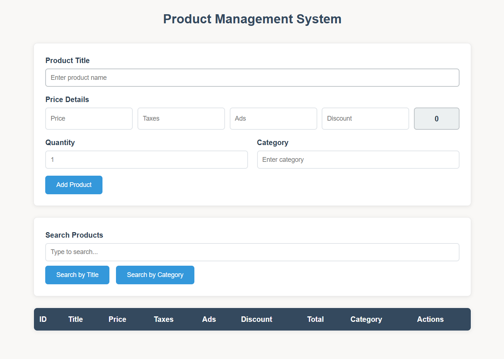
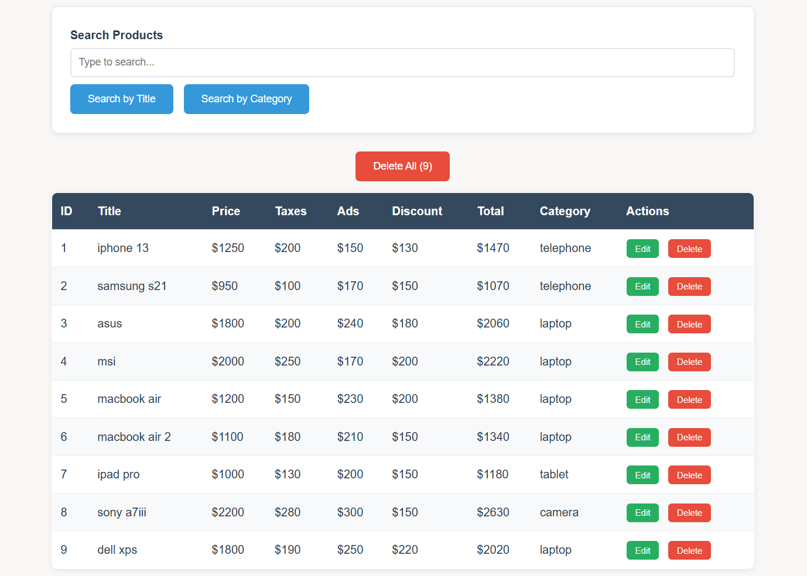
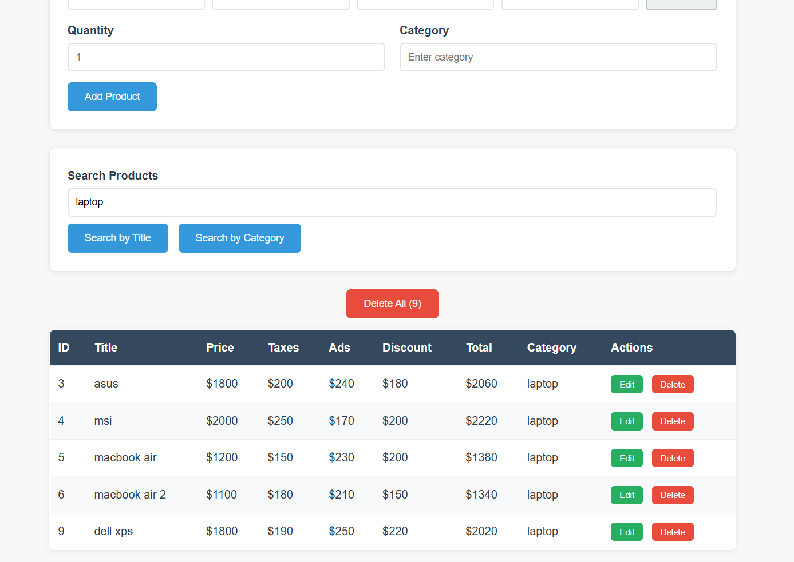

# Product Management System

A simple web app to manage your products. Add, edit, delete, and search products easily.




## Features

- Add new products with price details
- Edit existing products
- Delete products
- Search by name or category
- Auto calculate total price
- Data saves automatically


## How to Use

### Add Product
1. Enter product name
2. Fill in price, taxes, ads, discount
3. Add quantity and category
4. Click "Add Product"


### Manage Products
- **Edit**: Green button to change product
- **Delete**: Red button to remove product
- **Delete All**: Remove everything




### Search
- Type in search box
- Choose "Search by Title" or "Search by Category"
- Results show instantly




## Setup

1. Download files
2. Open `index.html` in browser
3. Start using!

No installation needed.

## Files

```
├── index.html     # Main file
├── scripts.js     # JavaScript code  
├── style.css      # Styling
├── README.md      # This file
└── assets/        # Screenshots
```

## 👨‍💻 Author

- [](https://github.com/sahiralzakaria) **GitHub:** [sahiralzakaria](https://github.com/sahiralzakaria)  
- [](https://www.linkedin.com/in/sahir-zakaria-39873531b) **LinkedIn:** [sahir-zakaria](https://www.linkedin.com/in/sahir-zakaria-39873531b)  
- [](mailto:sahir.alzakaria@gmail.com) **Email:** sahir.alzakaria@gmail.com  

---


<div align="center">
  <p>Made with ❤️ by <strong>Sahir Zakaria</strong></p>
  <p><em>Happy Coding! 🚀</em></p>
</div>

---


